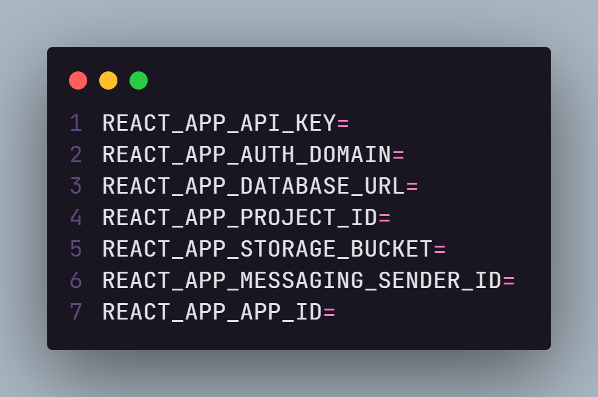

# 💬 Letmeask

Projeto desenvolvido durante a Next Level Week #6 da Rocketseat.

 

 

## 🟢 Experimente agora

Disponível [aqui](https://letmeask-pearl.vercel.app/).

 

## ⚙ Melhorias

- 📱 Reponsividade.
- 🌗 Escolha de tema (dark / light).
- ⏱ Loading.
- ❌ Tela de erro.
- 🏳 Modais e alertas.
- 🔒 Autenticação de rotas privadas.
- 💬 Permitir resposta do admin.
- 🟢 Deploy na Vercel.

 

## 🚀 Tecnologias

- ⚛️ [React.js](https://pt-br.reactjs.org/).
- 💅 [Styled-Components](https://styled-components.com/).
- 🔥 [Firebase](https://console.firebase.google.com/).

 

## 💻 Como usar

- **_Clone o projeto:_**  
- ` git clone https://github.com/lmiguelm/Letmeask`

- **_Entre na pasta do projeto:_**  
  `cd letmeask`

- **_Baixe as dependências:_**  
  ` yarn || npm install`

- **_Configure as variáveis ambiente:_**  
  `Entre no arquivo .env-example e crie suas variaveis`

  

- **_Rodar o app:_**  
  `yarn start || npm run start`

 

## 📝 Licença

Esse projeto está sob a licença MIT. Veja o arquivo [LICENSE](https://github.com/lmiguelm/Letmeask/blob/master/LICENSE.md) para mais detalhe
